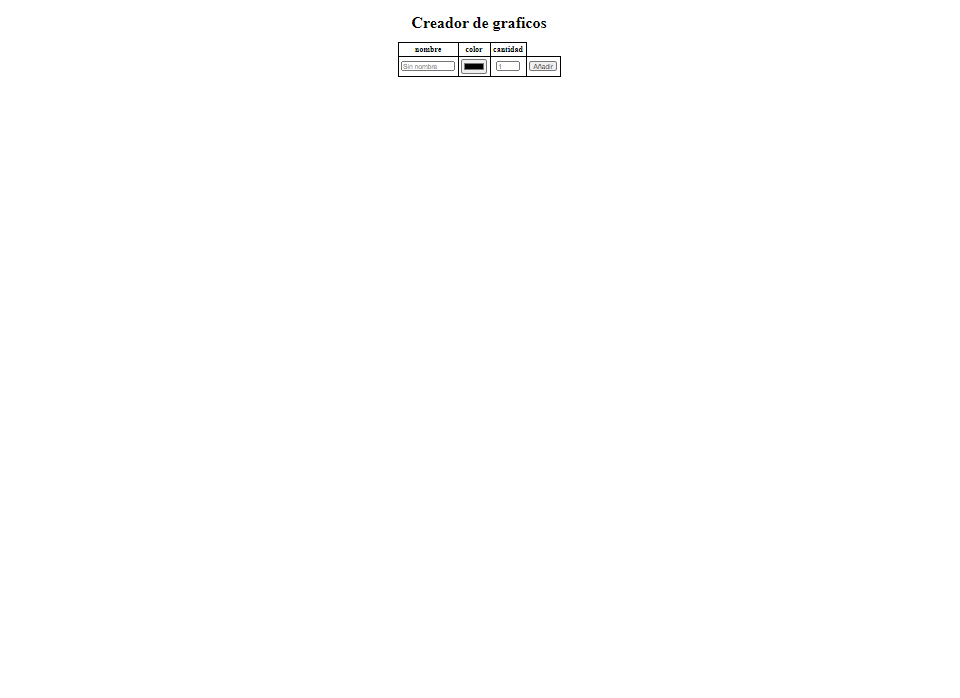

# **Canvas Chart Generator**

Canvas charts generator 📊 📈 with different options kinds.

## **Table of contents**

- [**Canvas Chart Generator**](#canvas-chart-generator)
  - [**Table of contents**](#table-of-contents)
  - [**General info**](#general-info)
  - [**Demo**](#demo)
  - [**Screenshots**](#screenshots)
  - [**Technologies**](#technologies)
  - [**Setup**](#setup)
  - [**Usage**](#usage)
  - [**Status**](#status)
  - [**Contact**](#contact)

## **General info**

**Date**: February, 2020
**Duration**: 1 Day.

It was an exercise to practice a basic **Canvas** without libraries and I wanted to take advantage of **Vue** to improved it.
Thanks to vue, I have been able to separate each chart in a new component and offer live options for add, set and delete the data added with options.

## **Demo**

You can try it using the [Demo](https://udsgit.github.io/canvas-chart-generator).

> <br><i>Demo</i>

## **Screenshots**

> <br><i>Example of generating chart on social networks.</i>

## **Technologies**

- **Html**&nbsp;&nbsp;_(Canvas)_
- **Css**
- **JavaScript**
- [**Vue**](https://vuejs.org/)

## **Setup**

It has no installation, you just need to clone or download the repository.

```console
git clone https://github.com/udsgit/canvas-chart-generator.git
```

## **Usage**

1. Open the link from the [Demo](https://udsgit.github.io/canvas-chart-generator) or open the file **index.html** if you downloaded it.
2. Now you can interact with the web, just write the name from the data that you want to convert to chart, next select the color and the percentage and press **_Añadir_**.
3. After add all the data that you want, you have the live options to set and delete it.

## **Status**

Project is: **_Completed._**

Because the functionality was to practice with **Canvas** and take advantage of **Vue**.

## **Contact**

Created by [@Emmanuel](https://www.linkedin.com/in/emagleza/), feel free to contact me!
